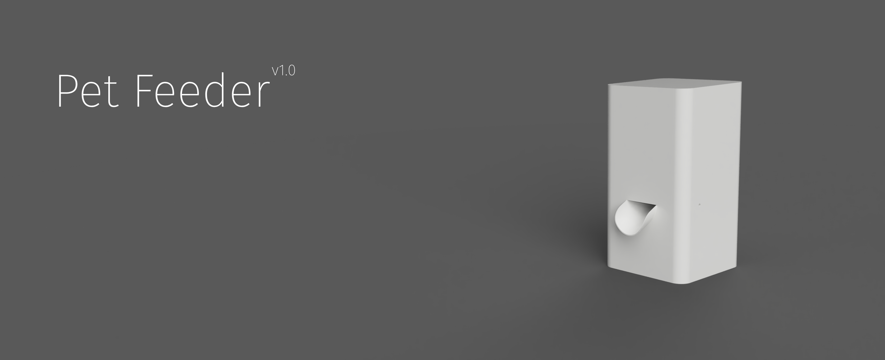
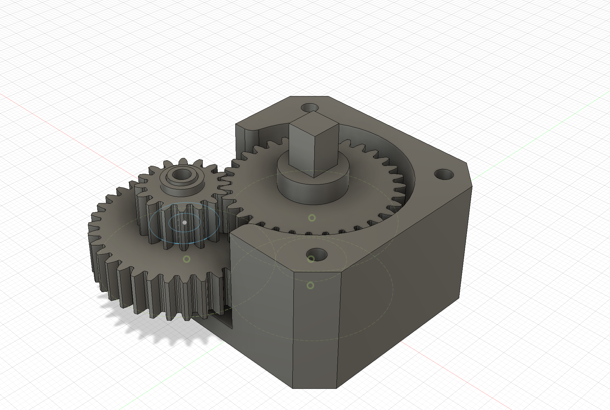
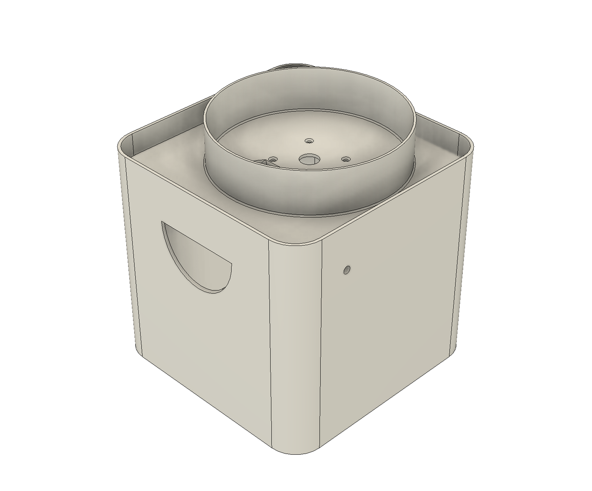
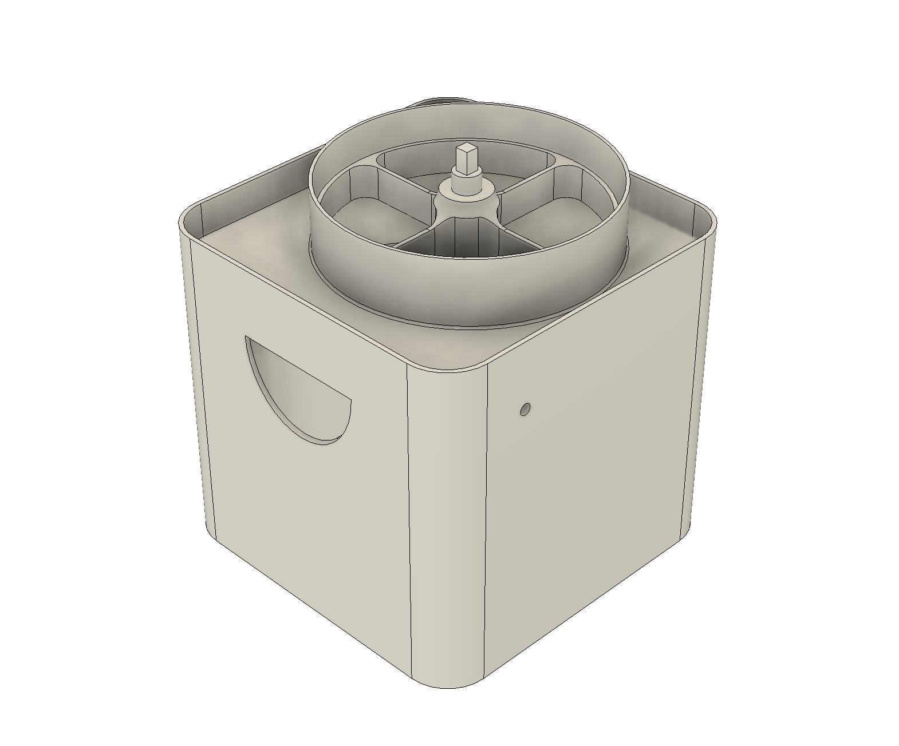
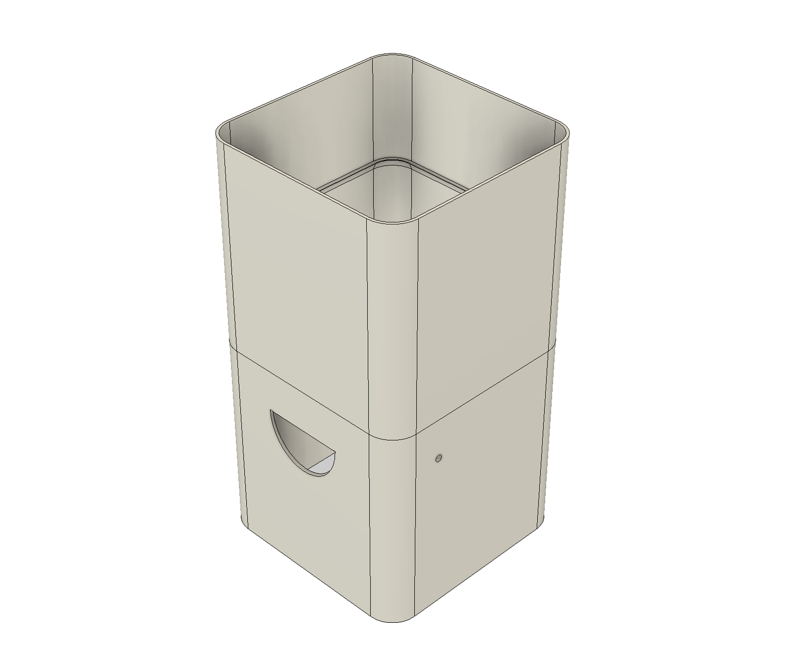
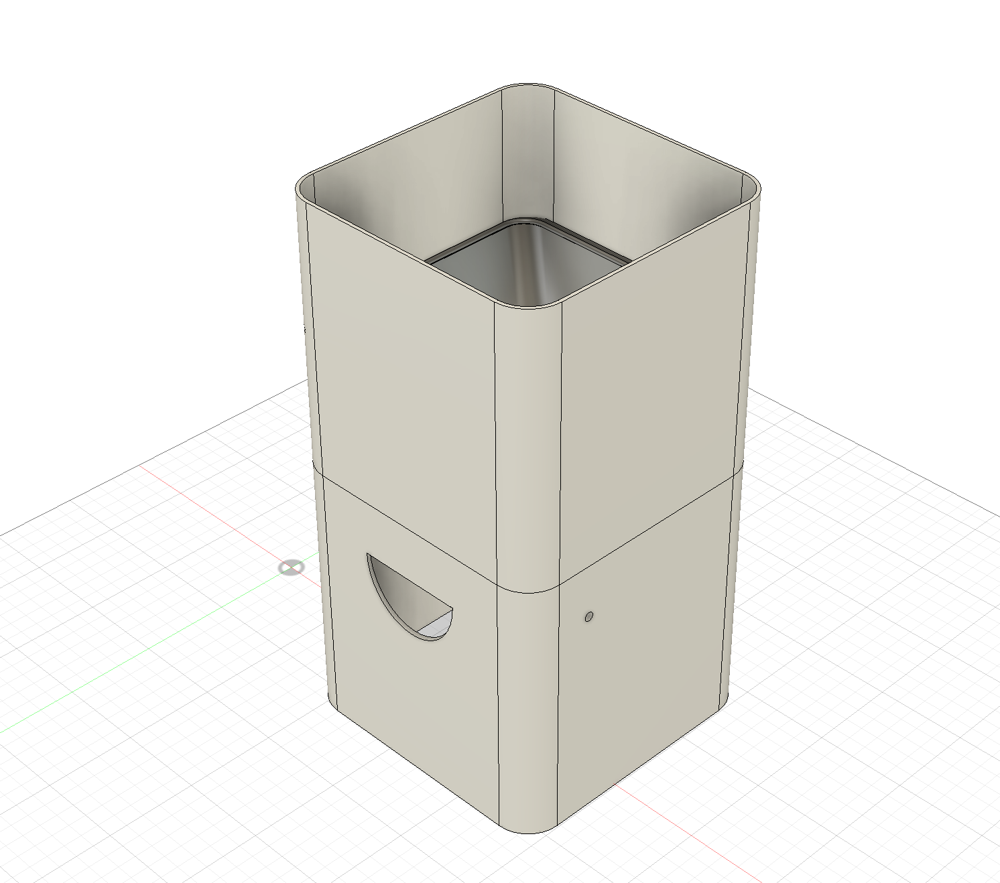
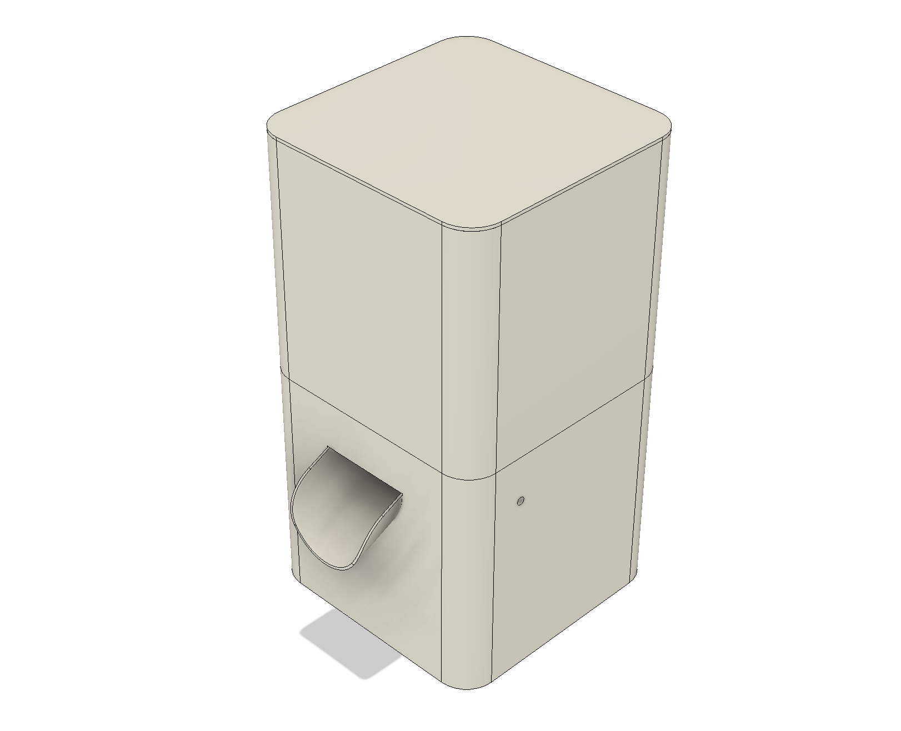
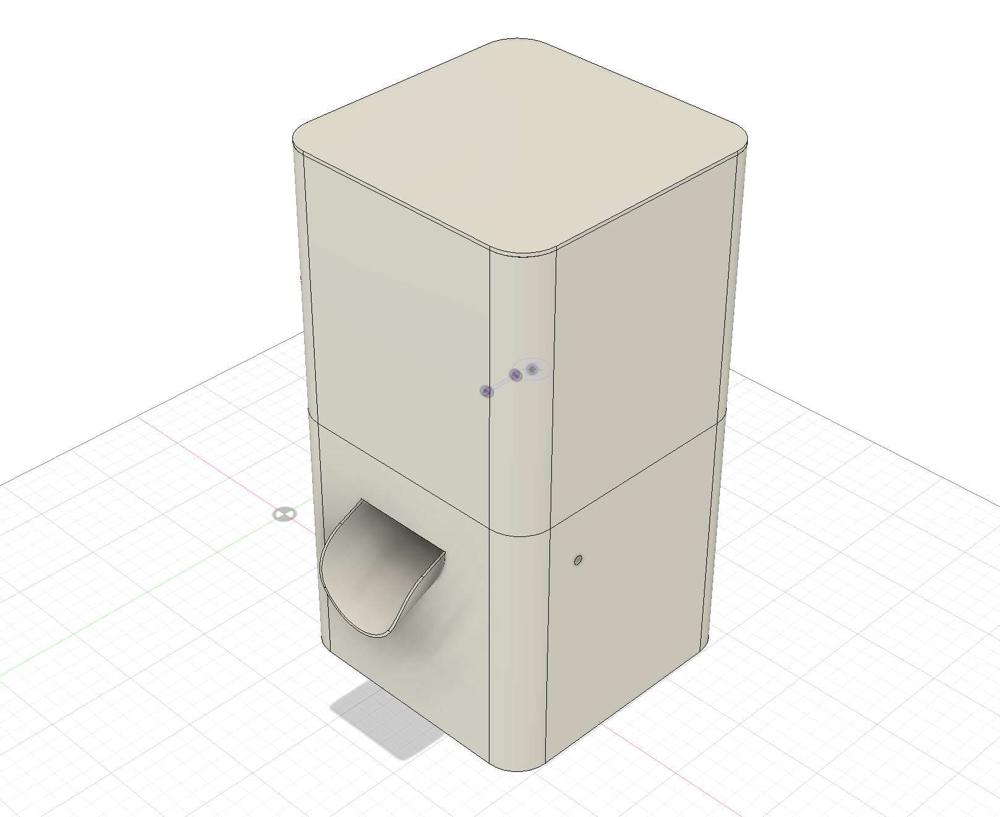
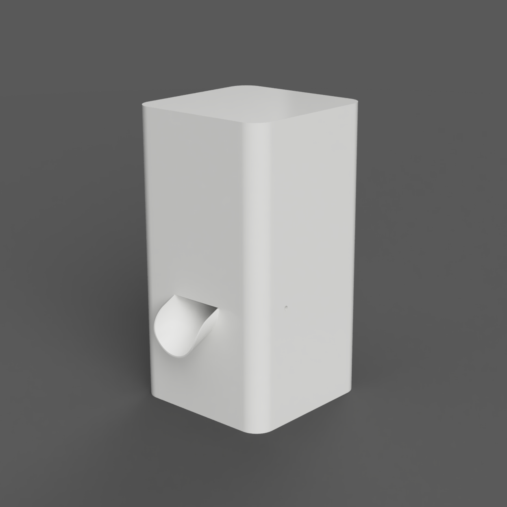
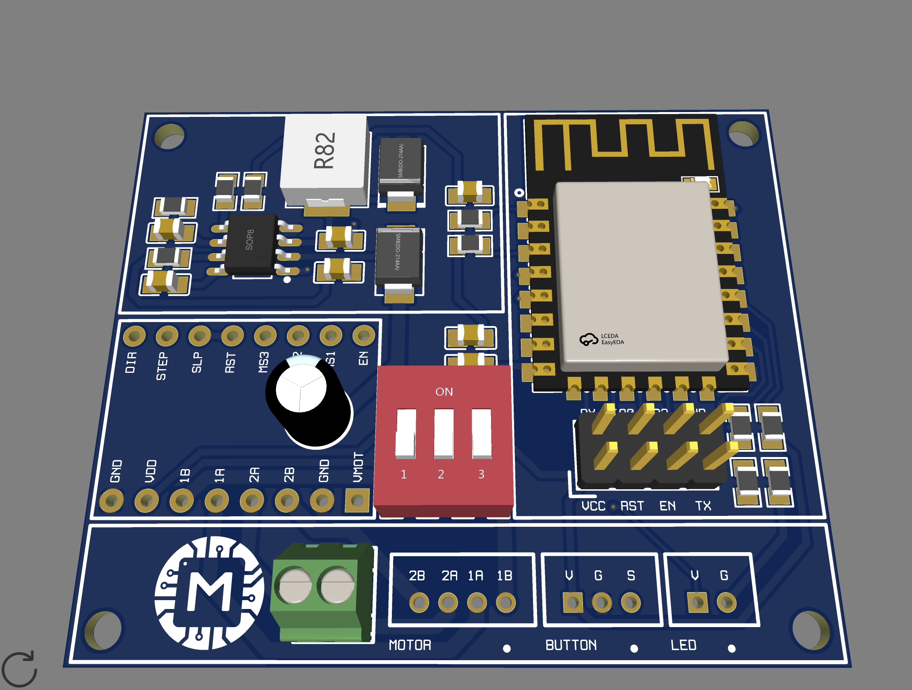

# Pet Feeder

Smart feeder for pets. Works according to schedule. Supports Wifi and MQTT. WiFi remote based on ESP8266.

## Features
- Scheduled feeding
- Supports WiFi
- Supports MQTT
- Possibility of integration with a smart home

## Assembled device
The **STL** folder contains all the files necessary for printing.

### Reductor
Reductor designed for stepper motor **Nema 17**.

### Case
Step 1

Step 2

Step 3

Step 4

Step 5

Step 6

Final

## PCB

In the **PCB** folder you will find everything you need to produce a printed circuit board.

### Main components are:

- ESP8266 (ESP-12F)
- Stepper driver A4988
- MP2307DN
- Inductor 10uH
- Pair diodes SS34
- Switch (TA-03)
- Pair JST connectors
- Screw connector
- Resistors and capacitors (0805)

Final view of the printed circuit board:
