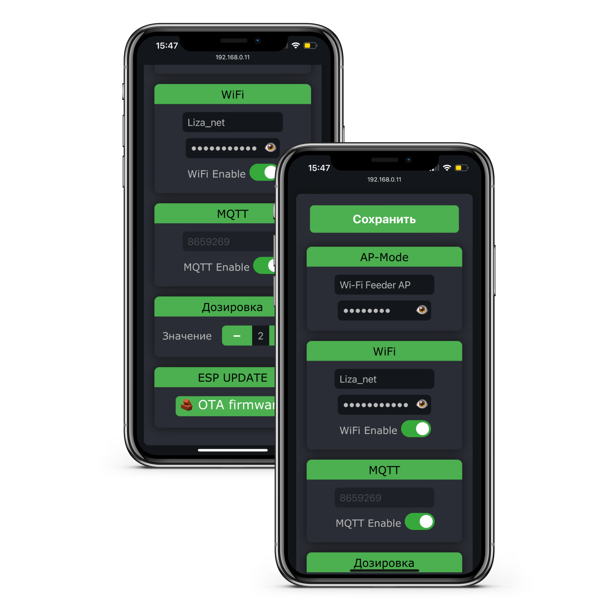
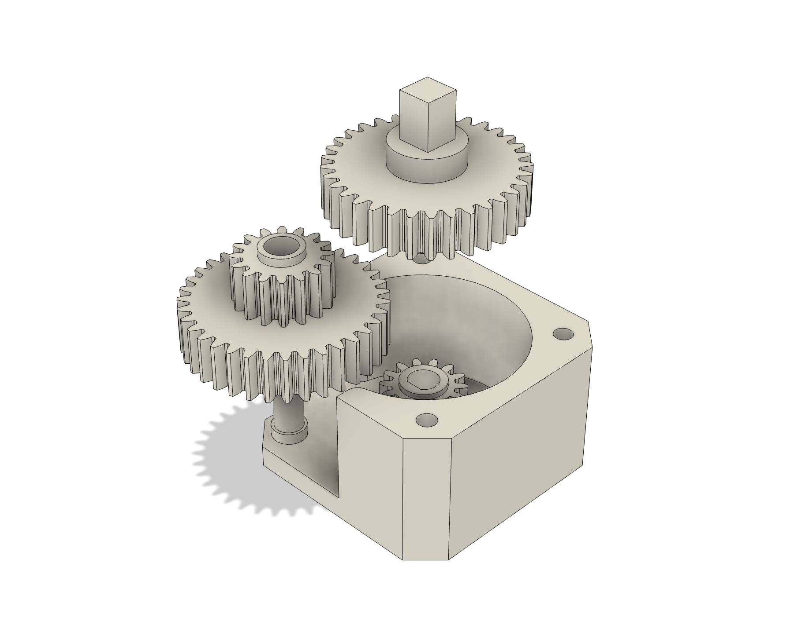
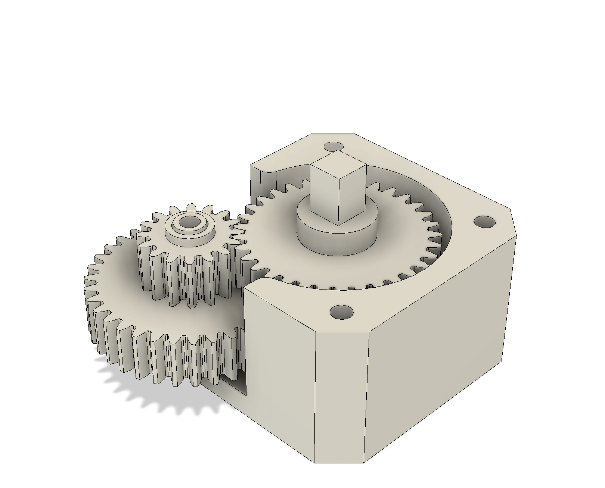
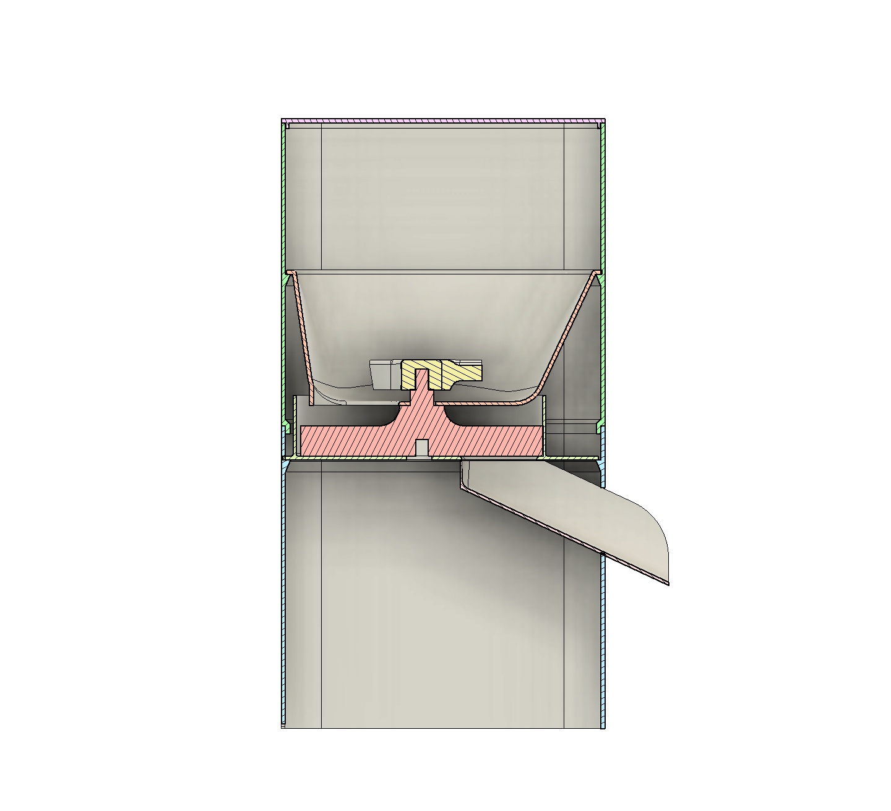
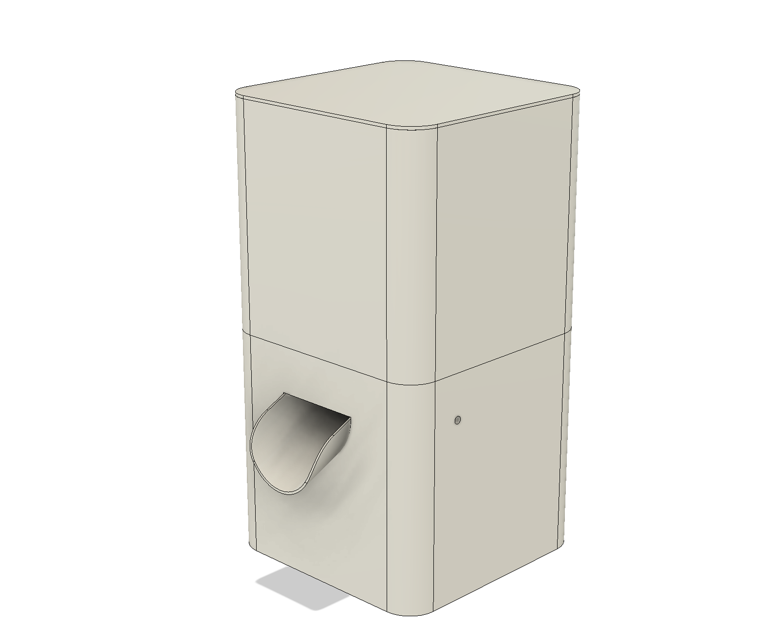

# Pet Feeder

Smart feeder for pets. Works according to schedule. Supports Wifi and MQTT. WiFi remote based on ESP8266.

## Features
- Scheduled feeding
- Supports WiFi
- Supports MQTT
- Possibility of integration with a smart home

## Web Server

Feeder settings are always available on the device web page `http://feeder.local`.

## Assembled device
The **STL** folder contains all the files necessary for printing.

### Reductor
Reductor designed for stepper motor **Nema 17**.

Use M3x30 countersunk screws to attach the reduction box to the assembly.

### Case
Step 1

Step 2

Step 3

Step 4

Step 5

Slice

Final

## PCB

In the **PCB** folder you will find everything you need to produce a printed circuit board.

### Main components are:

- ESP8266 (ESP-12F)
- Stepper driver A4988
- MP2307DN
- Inductor 10uH (0630; L7.0; W6.6)
- Pair diodes SS34 (SOD-123; L2.7; W1.6)
- Switch (TA-03)
- Pair JST connectors (2.0mm)
- Screw connector (KF128-2.54)
- Resistors and capacitors (0805)

And
- [Button TTP223](https://aliexpress.ru/item/32451378348.html?sku_id=66500187744)
- [Motor Nema 17](https://aliexpress.ru/item/32665922113.html?sku_id=65715688198)
- [Led](https://aliexpress.ru/item/1005004515135362.html?sku_id=12000029436349109)
- [JST Connectors](https://aliexpress.ru/item/4000091077742.html?sku_id=10000000242277758)

Final view of the printed circuit board:

Thanks [@AlexGyver](https://github.com/AlexGyver) for awesome [libs](https://github.com/GyverLibs).
